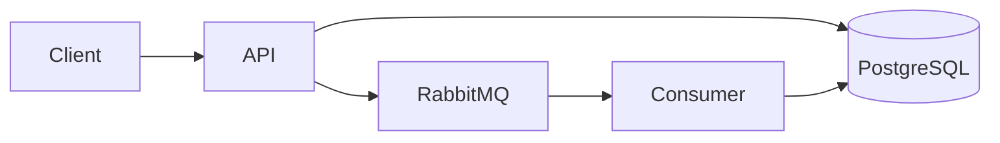
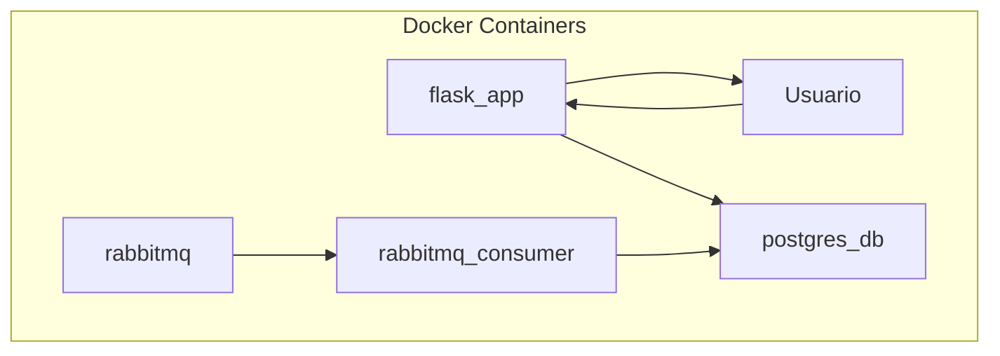

# Relatório Técnico do Projeto

## Descrição do Projeto

Este projeto tem como objetivo desenvolver uma aplicação de gerenciamento de pedidos utilizando a arquitetura DDD (Domain-Driven Design), com foco em escalabilidade e integração assíncrona entre serviços. A aplicação é composta por um backend desenvolvido em Flask, um consumidor RabbitMQ para processar mensagens assíncronas, e uma base de dados PostgreSQL, todos orquestrados com Docker.

## Plano de Trabalho

O plano de trabalho consistiu na criação de um ambiente completamente containerizado. Para isso, optei por utilizar Docker para isolar cada serviço:

- **app**: Serviço principal com Flask.
- **consumer**: Consumidor de mensagens do RabbitMQ.
- **db**: PostgreSQL para armazenamento de dados.
- **rabbitmq**: Gerenciador de filas com interface de gerenciamento.

## Desvios de Planejamento

Não houve desvios significativos em relação ao planejamento inicial. A estrutura definida foi implementada com sucesso, incluindo a comunicação entre serviços.

## Tecnologias Utilizadas

- **Flask** (Backend REST)
- **RabbitMQ** (Mensageria assíncrona)
- **Docker** (Containerização)
- **PostgreSQL** (Banco de dados relacional)

## Linguagens, Versões, IDEs e SO

- **Python**: 3.11
- **SQL**: padrão PostgreSQL
- **IDE**: Visual Studio Code
- **Sistema Operacional**: Linux Mint

## Diagrama de Arquitetura da Solução



## Diagrama de Implantação



## Modelagem da Base de Dados

```sql
CREATE TABLE IF NOT EXISTS pedidos (
  id SERIAL PRIMARY KEY,
  codigo_pedido INT,
  codigo_cliente INT,
  valor_total FLOAT,
  created_at TIMESTAMP DEFAULT CURRENT_TIMESTAMP
);
```

## Infraestrutura Cloud (Simulada localmente via Docker)

- **Máquina Host**: Linux Mint (x86_64)
- **Docker**: Usado para simular a infraestrutura em cloud com rede bridge customizada
- **Serviços rodando em containers**: Flask App, RabbitMQ, PostgreSQL e Consumer

## Evidências de Testes Funcionais

Foram realizados testes manuais e automatizados para validação dos seguintes fluxos:

- Envio de pedidos via API
- Persistência dos dados no PostgreSQL
- Processamento de mensagens via RabbitMQ
- Consumo assíncrono das mensagens com o serviço consumer

<strong>Valor total do pedidos Listagem de todos os pedidos do cliente</strong>


<strong>Quantidade de pedidos do cliente</strong>


## Repositório GitHub

- **Perfil GitHub**: [https://github.com/Cauatn](https://github.com/Cauatn)
- **Repositório com o código**: [https://github.com/Cauatn/hertz-challenge-1](https://github.com/Cauatn/hertz-challenge-1)

## DockerHub

- **Perfil DockerHub**: [https://hub.docker.com/u/cauatn](https://hub.docker.com/u/cauatn)
- **Imagens do projeto**: [https://hub.docker.com/r/cauatn/hertz-challenge-1/tags](https://hub.docker.com/r/cauatn/hertz-challenge-1/tags)

Para fazer o download das imagens docker utilizadas

```bash
docker pull cauatn/hertz-challenge-1:app       # API REST Flask
docker pull cauatn/hertz-challenge-1:consumer  # Consumer RabbitMQ
docker pull cauatn/hertz-challenge-1:postgres  # Banco de dados
docker pull cauatn/hertz-challenge-1:rabbitmq  # Gerenciador de filas
```

## Metodologias e Técnicas

- **Arquitetura**: Domain-Driven Design (DDD)
- **Mensageria**: Padrão de comunicação assíncrona com RabbitMQ
- **Testes**: Estratégias manuais e unitárias

## Referências

- Flask Documentation - https://flask.palletsprojects.com/
- RabbitMQ Docs - https://www.rabbitmq.com/documentation.html
- Docker Docs - https://docs.docker.com/
- PostgreSQL Docs - https://www.postgresql.org/docs/
